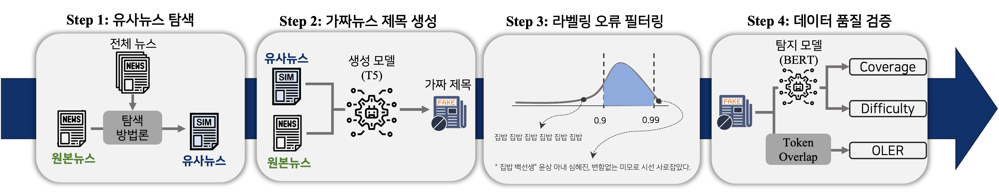

# 비지도 학습 기반 가짜뉴스 생성 프레임워크 및 데이터셋 품질 평가 지표의 효과성 연구
본 레포지토리는  `비지도 학습 기반 가짜뉴스 생성 프레임워크`의 구현 및 평가 과정을 담고 있습니다.  
해당 연구는 다음 논문화 과정을 거친 보고서를 기반으로 하고 있습니다 :  
김중훈, 박새란, 이지윤, 김재희, 강필성 [비지도 학습 기반 가짜뉴스 생성 프레임워크 및 데이터셋 품질 평가 지표의 효과성 연구] 고려대학교 산업경영공학과 대학원 수업 비정형 데이터 분석 6조
  
## 1. 프레임워크 
제안 프레임워크는 비지도 학습 방법론을 통해 진짜뉴스 만으로 가짜뉴스 제목을 생성하고, 생성된 제목에 대한 필터링 및 평가과정을 수행합니다. 


### 1-1. 유사뉴스 탐색
- 원본뉴스와 가장 유사한 뉴스를 탐색하는 과정
- 본 연구에서는 TF-IDF를 최종 모델로 선정하여 유사뉴스를 추출합니다. 
- 관련 코드는 `replacement`에서 확인 및 실행 가능합니다. 

### 1-2. 가짜뉴스 제목 생성
- 본문을 입력으로 제목을 생성하도록 T5를 훈련합니다. 
- 사전학습 모델은 `KETI-AIR/ke-t4-base-newslike`을 사용하였습니다. 
- T5 훈련 코드는 `T5/finetuneing`에서 확인 가능합니다. 
- 훈련된 T5에 유사뉴스 본문과 원본뉴스 본문을 입력하여 가짜뉴스 제목을 생성합니다. 
- 생성 코드는 `T5/generation`에서 확인 가능합니다. 

### 1-3. 라벨링 오류 필터링
- 생성된 가짜뉴스 제목 중 실제뉴스 제목으로 사용할 수 있는 제목을 필터링하는 과정입니다. 
- BERTScore를 통하여 필터링하였으며, 사용모델은 klue/roberta-large입니다. 
- BERTScore 계산을 위한 패키지는 [KoBERTScore](https://github.com/lovit/KoBERTScore)를 이용하였으며, 일부 소스 코드 수정으로 본 레포지토리에 포함되어 있습니다. 
- 관련 코드는 `filtering`에서 확인가능합니다. 

### 1-4. 데이터 품질 검증
- 라벨링 오류 필터링을 통해 생성된 최종 가짜뉴스 데이터의 품질을 측정하는 과정입니다. 
- 해당 과정을 위해 3가지 평가지표를 제안하였으며, 각 평가지표는 아래 코드에서 확인 가능합니다.  
(1) Overall Labeling Error Rate : `filtering`  
(2) Coverage : `Fishing`  
(3) Difficulty : `Fishing`

## 2. 전체 디렉토리 구조 
 ```
 data (본 파이프라인에서 다루는 모든 데이터를 저장하는 디렉토리)
 ├─ preprocess_data.ipynb(AI Hub 데이터를 본 파이프라인에 적용하기 위한 전처리 프로세스가 담긴 ipynb 파일)
 ├─ T5 : train_t5.csv (t5 학습용 실제뉴스 데이터)
 ├─ Real (가짜뉴스 탐지모델 학습용 실제뉴스 데이터)
    ├─ train.csv
    ├─ val.csv
    └─ test.csv
 ├─ Fake (생성된 가짜뉴스)
    ├─ fake_original.csv (가짜뉴스 생성용 실제뉴스 데이터)
    └─ method 1 (생성 방법론 1 가짜뉴스 데이터)
       ├─ generated (생성 원문)
       └─ filtered (BERTScore를 통한 필터링 이후 가짜뉴스 데이터)

 replacement(유사뉴스 탐색을 위한 TF-IDF 실행 디렉토리)
 ├─ make_dataset.py (유사뉴스 탐색용 py 파일)
 ├─ run.sh (유사뉴스 탐색 실행 파일)
 └─ sim_index_method.json (유사뉴스 탐색 결과 파일)

 make_dataset(유사뉴스 탐색 결과를 실제 데이터에 적용하기 위한 디렉토리)
 ├─ make_dataset.py (유사뉴스를 실제뉴스와 함께 사용하도록 전처리하는 py 파일)
 └─ run.sh (make_dataset.py를 실행하는 실제 실행 파일)

 T5(가짜뉴스 생성용 모델 학습 및 생성 디렉토리)
 ├─ finetuning (가짜뉴스 생성용 모델 학습 디렉토리)
    └─ train.py (가짜뉴스 생성용 모델 학습 py 파일)
 └─ generation (가짜뉴스 생성 디렉토리)
    └─ generate.sh (가짜뉴스 생성 실행 파일)

 Fishing (가짜뉴스 탐지 모델 학습 및 평가지표 디렉토리)
 ├─ run.sh (가짜뉴스 탐지모델 학습 실행 파일)
 └─ make_results.py (가짜뉴스 데이터 평가지표 산출 py 파일)

 filtering (생성된 가짜뉴스 데이터에 대한 필터링 및 평가지표 산출 디렉토리)
 ├─ KoBERTScore(BERTScore 산출용 소스파일 디렉토리)
 ├─ filter_bertscore.py(BERTScore를 이용한 가짜뉴스 데이터 필터링 py 파일)
 ├─ filter_bertscore.sh (BERTscore를 이용한 가짜뉴스 데이터 필터링 실행 파일)
 ├─  eval_by_tokenoverlap.py (생성된 가짜뉴스에 대한 OLER 산출 py 파일)
 ```

## 3. 실행 순서
가짜뉴스 데이터 생성 및 평가를 위한 실행 순서는 다음과 같습니다.  
1. [AI HUB 낚시성 기사 탐지 데이터](https://www.aihub.or.kr/aihubdata/data/view.do?currMenu=115&topMenu=100&aihubDataSe=realm&dataSetSn=71338)를 다운로드 합니다. 
2. `data/preprocess_data.ipynb` 파일을 이용하여 본 파이프라인에 적용할 수 있는 형태로 전처리를 수행하고 `data` 디렉토리 내부에 저장합니다. 
3. `replacement` 디렉토리 내 `run.sh`를 이용하여 유사뉴스 탐색을 진행합니다. 그 결과 `sim_index_method.json`파일이 생성됩니다. 
4. `sim_index_method.json` 파일을 `make_dataset` 디렉토리로 이동한 후 `run.sh` 파일을 실행하여 진짜뉴스와 유사뉴스 데이터를 함께 담고 있도록 전처리를 수행합니다. 
5. 뉴스 본문을 입력으로 제목을 생성하도록 T5 모델을 finetuning합니다. 이는 `T5/finetuning` 디렉토리를 통하여 수행됩니다. 
6. 학습된 T5 모델에 전처리된 뉴스 데이터를 입력으로 가짜뉴스를 생성합니다. 이는 `T5/generation` 디렉토리를 통하여 수행됩니다. 
7. 생성된 가짜뉴스 데이터에 대한 필터링을 수행합니다. 이는 `filtering/filter_bertscore.sh` 파일을 실행하여 수행됩니다. 
8. OLER 지표를 산출합니다. 이는 `filtering/eval_by_tokenoverlap.py`를 통해 지표를 산출합니다. 
9. 진짜뉴스 데이터와 가짜뉴스 데이터를 통해 학습한 BERT 모델을 통해 Coverage와 Difficulty 지표를 산출합니다. 이는 1) `Fishing/run.sh`를 통한 BERT 모델 학습 2) `Fishing/make_results.py`을 이용하여 학습된 BERT 모델을 통한 지표 산출 두 과정으로 이루어집니다.